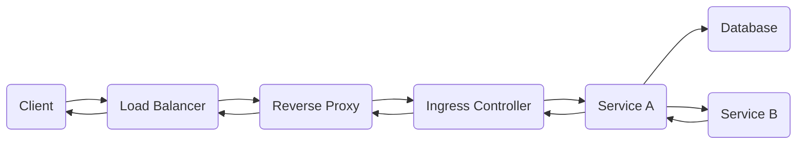

When two services interact in a system, the communication can occur in several ways, depending on the architecture and the protocols used. Here’s a detailed explanation of different techniques through which two services can interact, along with practical examples, and the components involved in the process.

#### 1. **HTTP/HTTPS (RESTful API Communication)**
**Scenario**: Service A (User Service) and Service B (Order Service)

- **Context**: Service A needs to fetch user-related orders from Service B via a REST API. 
- **Practical Example**: A User Service requests the list of orders for a user, and the Order Service responds with the data.

##### Components:
- **Service A**: User Service
- **Service B**: Order Service
- **Protocol**: HTTP/HTTPS
- **Components**:
  - **NGINX** (Reverse Proxy): Routes requests from Service A to Service B.
  - **Load Balancer**: Ensures traffic is balanced across multiple instances of Order Service.
  - **DNS Resolution**: Service A uses DNS to resolve the address of Service B.
  - **Security**: TLS for encryption of HTTPS traffic, API Gateway for request management.

##### Flow:
1. **DNS Lookup**: Service A queries an internal DNS server to get the private IP address of Service B (Order Service) based on its domain name (e.g., `order-service.internal`).
2. **HTTP Request**: Service A sends an HTTP GET request to the resolved IP address, asking for order data (e.g., `https://order-service.internal/orders?userId=123`).
3. **NGINX**: If used as a reverse proxy, NGINX may route the request to the correct instance of Service B based on load balancing.
4. **Load Balancer**: If traffic needs to be balanced, an Application Load Balancer (ALB) distributes requests to one of several available instances of Service B.
5. **Service B**: Order Service processes the request, queries its database, and returns the list of orders.
6. **HTTP Response**: Service B sends back the response in JSON format (e.g., `[{ orderId: 1, item: "Book" }]`).
7. **Service A**: Receives and processes the response to display to the user.

##### Advantages:
- Simple and widely adopted.
- Works well for stateless operations.
- Easy to debug and monitor using logs.

##### Challenges:
- Latency: Each API call introduces network overhead.
- Security: Requires TLS and proper authentication (e.g., OAuth, JWT).
  
---

#### 2. **Message Queues (Asynchronous Communication)**
**Scenario**: Service A (Email Service) and Service B (Notification Service)

- **Context**: Service A sends a message to Service B to notify users about an email update. Instead of synchronous API calls, they communicate via a message queue for better scalability and decoupling.
- **Practical Example**: Email Service queues a message for Notification Service, which processes and sends out notifications.

##### Components:
- **Service A**: Email Service
- **Service B**: Notification Service
- **Protocol**: AMQP, MQTT, or proprietary message protocol
- **Components**:
  - **Message Broker** (e.g., RabbitMQ, AWS SQS): Facilitates message queuing and delivery.
  - **Queues**: Dedicated queues for each service (e.g., `email-queue`, `notification-queue`).
  - **Security**: Private network for communication, with encryption of messages (e.g., TLS).

##### Flow:
1. **Message Creation**: Service A (Email Service) creates a message with details about the email event (e.g., `{"emailId": 123, "status": "sent"}`).
2. **Queueing**: Service A sends the message to a message broker (e.g., RabbitMQ or AWS SQS), which enqueues it in a queue (e.g., `notification-queue`).
3. **Broker**: The message broker holds the message in the queue until Service B (Notification Service) is ready to process it.
4. **Message Consumption**: Service B subscribes to the `notification-queue` and listens for new messages. When a message arrives, it processes it (e.g., sending a notification to the user).
5. **Acknowledgment**: Service B acknowledges receipt of the message. The broker removes the message from the queue after successful processing.
6. **Retry**: If Service B fails to process the message, it may be re-queued for later attempts (depending on the broker's configuration).

##### Advantages:
- **Asynchronous**: Service A doesn’t wait for Service B to respond, allowing them to operate independently.
- **Decoupling**: Services are loosely coupled, improving scalability.
- **Reliability**: Messages can be retried if they fail.

##### Challenges:
- Complexity in managing the message broker and queues.
- Requires proper handling of message failures (e.g., dead-letter queues).

---

#### 3. **gRPC (Remote Procedure Call)**
**Scenario**: Service A (Inventory Service) and Service B (Pricing Service)

- **Context**: Service A calls a method in Service B using gRPC to get pricing information. gRPC is a high-performance, language-agnostic remote procedure call (RPC) framework.
- **Practical Example**: Inventory Service requests pricing details for an item from Pricing Service.

##### Components:
- **Service A**: Inventory Service
- **Service B**: Pricing Service
- **Protocol**: HTTP/2, Protobuf (serialization format)
- **Components**:
  - **gRPC Server**: Exposes methods that can be called remotely (Service B exposes methods like `GetPrice`).
  - **gRPC Client**: Service A uses a client stub to call the method in Service B.
  - **Security**: TLS for secure communication.

##### Flow:
1. **gRPC Client Stub**: Service A uses a generated gRPC client stub to interact with Service B.
2. **Method Call**: Service A calls a method on Service B (e.g., `GetPrice`) by invoking the gRPC stub method.
3. **Protobuf Serialization**: gRPC uses Protobuf to serialize the request and send it over HTTP/2.
4. **gRPC Server**: Service B receives the request, deserializes it, and processes the `GetPrice` method.
5. **Response**: Service B sends the response (e.g., the price of the item) back to Service A, which deserializes it.
6. **Secure Communication**: The entire communication is secured with TLS.

##### Advantages:
- **High Performance**: Built on HTTP/2, gRPC offers low latency and supports streaming.
- **Strong Typing**: Protobuf provides strong typing and schema validation.
- **Bidirectional Streaming**: gRPC supports client-side, server-side, and bidirectional streaming.

##### Challenges:
- Requires more setup (Protobuf definitions, client stubs, and server implementation).
- Not as simple as REST for debugging or browser-based testing.

---

#### 4. **Service Mesh**
**Scenario**: Service A (Payment Service) and Service B (Order Service)

- **Context**: In a microservices architecture, Service A and Service B communicate via a service mesh that handles routing, security, and observability.
- **Practical Example**: Payment Service communicates with Order Service via Istio service mesh, which manages traffic flow, security, and monitoring.

##### Components:
- **Service A**: Payment Service
- **Service B**: Order Service
- **Service Mesh**: Istio, Linkerd
- **Components**:
  - **Sidecar Proxy**: Envoy or another proxy that handles traffic routing for each service.
  - **Control Plane**: Manages routing policies, security, and observability.
  - **Security**: mTLS for encrypted communication.

##### Flow:
1. **Sidecar Proxy**: Both Service A and Service B have an Envoy sidecar proxy injected.
2. **mTLS**: When Service A calls Service B, the communication is encrypted with mTLS, and both proxies verify the identity of the services.
3. **Traffic Routing**: The service mesh routes traffic based on defined policies (e.g., retry on failure, load balancing).
4. **Observability**: The service mesh provides observability into request latencies, retries, and failures.

##### Advantages:
- **Security**: mTLS by default for all service communication.
- **Resilience**: Automatic retries, circuit breaking, and failover policies.
- **Observability**: Built-in monitoring and tracing for all service interactions.

##### Challenges:
- Added complexity in managing the mesh.
- Performance overhead due to the sidecar proxies.

#### Conclusion

Different communication techniques can be employed based on the system's needs. For synchronous communication, HTTP/HTTPS (REST) or gRPC is common, while message queues and service meshes are better suited for more complex, asynchronous, or large-scale microservices architectures. Each technique has its own advantages, challenges, and the role it plays in ensuring service-to-service communication.

___

## Request-Response Flow in a Microservices Architecture

**Understanding the Components:**

* **Client:** The entity initiating the request (e.g., a web browser, mobile app).
* **Load Balancer:** Distributes incoming traffic across multiple servers to improve performance and reliability.
* **Reverse Proxy:** Acts as a gateway, handling requests and responses on behalf of backend servers.
* **VPC (Virtual Private Cloud):** A private network within a public cloud provider, providing isolation and security.
* **Ingress:** A Kubernetes resource that acts as a gateway for services within a cluster.
* **Kubernetes:** An open-source container orchestration platform.
* **Service A:** A microservice that interacts with a database and service B.
* **Service B:** Another microservice involved in the request-response process.
* **Database:** A storage system for data.

**Flow Diagram:**

1. **Client:** Sends a request to the load balancer.
2. **Load Balancer:** Distributes the request to a specific instance of the reverse proxy.
3. **Reverse Proxy:** Forwards the request to the ingress controller within the VPC.
4. **Ingress Controller:** Routes the request to a specific instance of Service A based on the defined rules.
5. **Service A:** Processes the request and may interact with the database. If necessary, it also calls Service B.
6. **Service B:** Processes the request from Service A.
7. **Service A:** Receives the response from Service B and continues processing the original request.
8. **Service A:** Sends the final response back to the ingress controller.
9. **Ingress Controller:** Forwards the response to the reverse proxy.
10. **Reverse Proxy:** Sends the response to the load balancer.
11. **Load Balancer:** Returns the response to the client.

**Visual Representation:**

**Key Points:**

* The load balancer ensures efficient distribution of traffic.
* The reverse proxy acts as a layer of abstraction.
* The VPC provides a secure and isolated environment for the microservices.
* The ingress controller manages traffic flow within the Kubernetes cluster.
* Service A and B can be scaled horizontally by adding more instances to handle increased load.

This flow diagram provides a basic overview of a request-response process in a microservices architecture. The specific components and configurations may vary depending on the requirements of your application.
